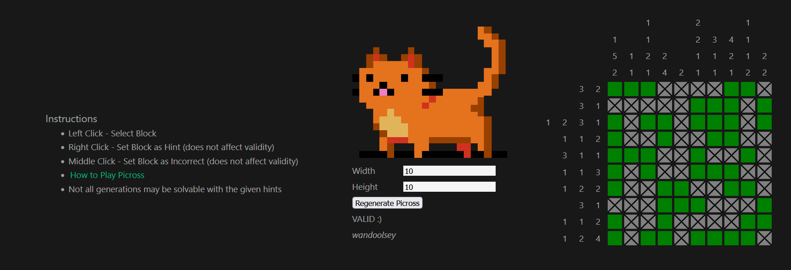

# picross



Third times the charm

## Notes to Self

- Clean up the display for the board
    - Add a bar to the bottom for buttons, entering a custom board size
    - Add a score counter for how many you've solved

- More functionality for the player
    - Let user build and design their own puzzle
    - Find some good way of saying it - an API with some basic DB functionality

- Add an animation for when the puzzle is completed

- Fix bug where the crossed state persists across regenerations
    - Since crossed is not a direct reactive element (i.e. defined in the Hint template in Board.vue)
    - The element itself is 'reused' since it's not unMounted and reMounted by the v-dom
    - Think of a different solution for this

## Customize configuration

See [Vite Configuration Reference](https://vitejs.dev/config/).

## Project Setup

```sh
npm install
```

### Compile and Hot-Reload for Development

```sh
npm run dev
```

### Type-Check, Compile and Minify for Production

```sh
npm run build
```
